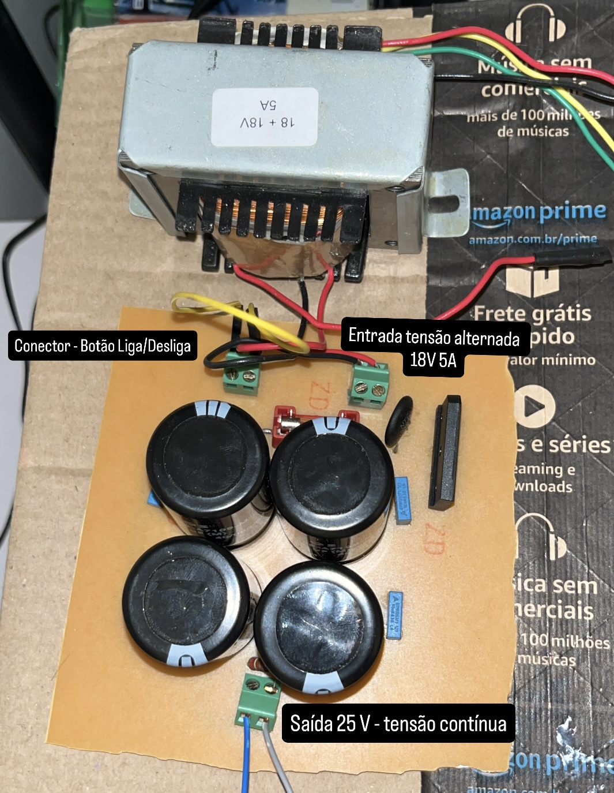
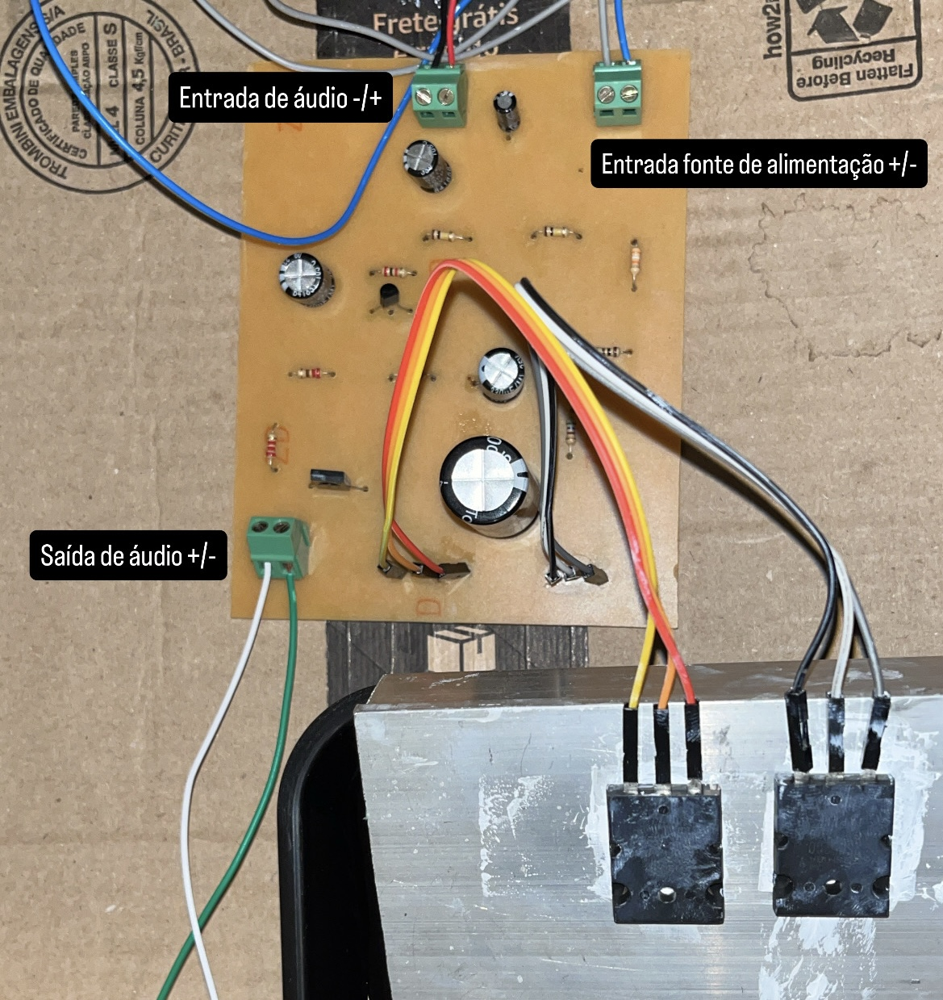

# Hi-Fi Audio Amplifier project

Class A audio amplifier project based on JLH 1969 project.

Lista de componentes com valores aproximados: [Lista de Componentes Eletrônicos](https://github.com/macielti/hi-fi-amp/blob/main/docs/Lista%20de%20Componentes%20Eletrônicos.md)

## Exemplo da placa Fonte de Alimentação montada

  

## Exemplo da placa Amplificadora de Áudio montada

  

